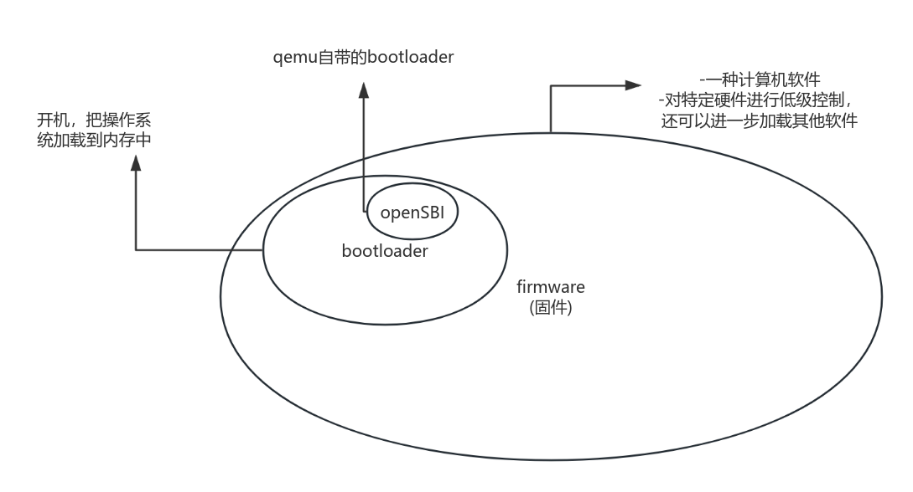
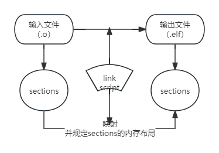
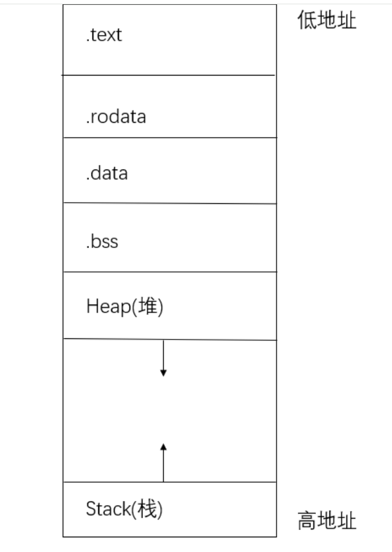
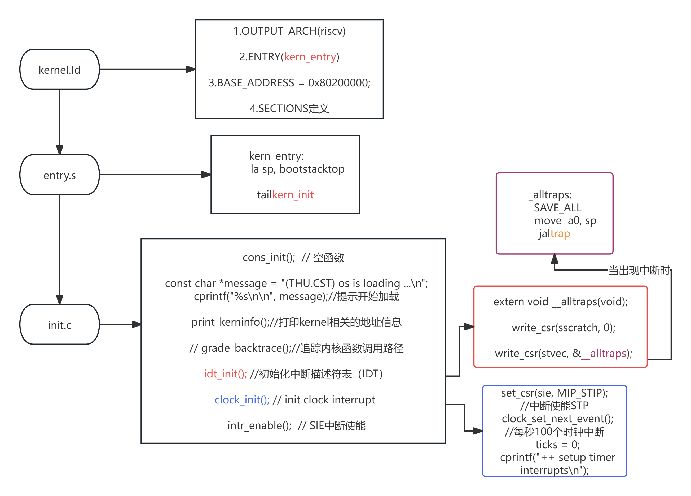

# lab0&1 final

## ·lab0

### 练习1：使用GDB验证启动流程

#### 先回答：RISCV硬件从上电到执行第一条指令（0x80200000)过程中，前几条指令对应的内容（0x1000）都在默认bios映像中。功能是计算出OpenSBI.bin这个bootloader的存放地址0x80000000,并跳转过去。之后的指令（0x80000000）在OpenSBI.bin中，功能是加载内核镜像.

#### 1.解读makefile

##### 1)make qemu

```
qemu: $(UCOREIMG) $(SWAPIMG) $(SFSIMG)
#	$(V)$(QEMU) -kernel $(UCOREIMG) -nographic
	$(V)$(QEMU) \
		-machine virt \
		-nographic \
		-bios default \
		-device loader,file=$(UCOREIMG),addr=0x80200000
```

-bios default:QEMU将自动加载和使用默认固件映像BIOS（基本输入输出系统，有些称为固件），而RISCV硬件从上电到执行第一条指令的过程中，这几条指令对应的内容都在bios映像中。

-加载指定的映像文件（tools/kernel.ld）到特定地址0x80200000

##### 2)make debug

```
debug: $(UCOREIMG) $(SWAPIMG) $(SFSIMG)
	$(V)$(QEMU) \
		-machine virt \
		-nographic \
		-bios default \
		-device loader,file=$(UCOREIMG),addr=0x80200000\
		-s -S
```

-s:启动QEMU的调试器

-S:在启动时暂停QEMU，等待GDB连接

##### 3)make gdb

```
gdb:
	riscv64-unknown-elf-gdb \
    -ex 'file bin/kernel' \
    -ex 'set arch riscv:rv64' \
    -ex 'target remote localhost:1234'
```

-riscv64-unknown-elf-gdb：指定使用的gdb调试器

-`-ex 'file bin/kernel':指定要调试的程序

-`-ex 'set arch riscv:rv64'：指定gdb运行的架构

-‘-ex 'target remote localhost:1234'：远程连接到主机的1234端口

#### 2.分别打开两个终端，进入lab0目录。一个终端执行make debug,一个终端执行make gdb。

##### 1）前者会构建相关目标并启动QEMU,以便进行调试，并使CPU在启动时暂停

##### 2）后者会直接启动GDB,以连接到QEMU的调试服务器，可在此处调试。

#### 3. x/10i $pc,显示即将执行的十条命令

```
(gdb)   x/10i $pc
=> 0x1000:      auipc   t0,0x0 #t0=0x1000
   0x1004:      addi    a1,t0,32 #a1=0x1020
   0x1008:      csrr    a0,mhartid #读取硬件线程ID,a0=0x0
   0x100c:      ld      t0,24(t0) #t0=0x8000000
   0x1010:      jr      t0
   0x1014:      unimp
   0x1016:      unimp
   0x1018:      unimp
   0x101a:      0x8000
   0x101c:      unimp
```


##### 1）观察到程序从0x1000开始，到0x10101处有一个跳转指令jr t0

##### 2）t0中存储的是0x80000000,这一步跳转到0x80000000

#### 4..设置两个断点，一个是break *0x8000000,一个是break kern_entry(发现在0x802000000处)

```
(gdb) break kern_entry
Breakpoint 2 at 0x80200000: file kern/init/entry.S, line 7.
```


#### 5.验证3.1）中t0存储的地址。逐步si,并在程序运行到0x10101 jr t0之前执行“info registers”，发现t0中存储的地址即为0x8000000，此步跳转到0x8000000。

```
(gdb) info registers
ra             0x0      0x0
sp             0x0      0x0
gp             0x0      0x0
tp             0x0      0x0
t0             0x80000000       2147483648
t1             0x0      0
t2             0x0      0
fp             0x0      0x0
s1             0x0      0
a0             0x0      0
a1             0x1020   4128
a2             0x0      0
--Type <RET> for more, q to quit, c to continue without paging--q
Quit
(gdb)   x/10i $pc      
=> 0x1010:      jr      t0
   0x1014:      unimp
   0x1016:      unimp
   0x1018:      unimp
   0x101a:      0x8000
   0x101c:      unimp
   0x101e:      unimp
   0x1020:      addi    a2,sp,724
   0x1022:      sd      t6,216(sp)
   0x1024:      unimp
```

#### 6.也可以简单观察一下0x800000处的指令，主要是实现初始化，配置和存储数据到内存

```
(gdb) x/10i 0x80000000
   0x80000000:  csrr    a6,mhartid
   0x80000004:  bgtz    a6,0x80000108
   0x80000008:  auipc   t0,0x0
   0x8000000c:  addi    t0,t0,1032
   0x80000010:  auipc   t1,0x0
   0x80000014:  addi    t1,t1,-16
   0x80000018:  sd      t1,0(t0)
   0x8000001c:  auipc   t0,0x0
   0x80000020:  addi    t0,t0,1020
   0x80000024:  ld      t0,0(t0)
```


#### ·知识点1：firmware,bootloader,特权级



OpenSBI属于M态（固件的特权级），还有U态（用户和应用程序的特权级）、S态（操作系统的特权级）

在QEMU执行任何指令之前，加载两个文件：

1）在 0x80000000 加载OpenSBI.bin

2）在0x80200000加载os.bin

### 知识点2：链接脚本、内存布局、可执行文件

1.链接脚本：



2.内存布局：



## ·lab1

注：运行流程



### ·练习1

#### 1.la sp,bootstacktop

##### 1)操作：把bootstacktop的地址加载到寄存器sp（堆栈指针）中，

##### bootstacktop指向的是内核启动时使用的栈的顶部

##### 2）目的：初始化堆栈指针，为内核运行做好准备

#### 2.tail kern_init

##### 1)操作：直接跳转到kern_init函数，不保留返回地址（kern_init执行完后不会回到kern_entry）

##### 2)目的：将控制权转移到内核初始化函数，开始整个内核初始化的过程


### 扩展challenge1：描述与理解中断流程

#### 1.ucore中处理异常的流程：

kern/trap/trapentry.S

##### 1)保存上下文

A.把原先的栈指针sp保存到sscratch中

B.把sp向低地址延申36个寄存器的空间

C.依次保存31个通用寄存器（sp借助sscratch存）、4+1个控制寄存器的值存入内存（栈中）

##### 2）调用中断处理程序

A.先把sp的值传递给a0,作为函数参数传递给函数trap

##### 3）恢复上下文

A.把内存（栈）中存储的两个CSR（sstatus,sepc）,以及除了sp的31个寄存器的值存回寄存器

B.恢复sp值，把内存中存储的sp值赋给sp

##### 其中，mov a0,sp的目的是把sp的值作为函数参数，借由a0传递给函数trap.

`void trap(struct trapframe *tf) { trap_dispatch(tf); }`

观察trap函数，发现接收了一个函数参数，为指向trapframe(存储了上下文信息)的指针。

#### 2.SAVE_ALL中寄存器保存在栈中的位置是什么确定的？

由sp（sp的值向低地址延申了36个REGBYTES）,以及索引*REGBYTES的偏移量确定。

#### 3.对于任何中断，__alltraps 中都需要保存所有寄存器吗？

不需要，不过为了简化设计，不为特定的中断类型而选择性保存，保存所有寄存器是最简便安全的。

比如zero寄存器，无法被修改，其实不必被保存。

比如一些不可恢复的中断（比如除0操作），也没有必要保存全部寄存器信息。


### 扩展challenge2：理解上下文切换机制

#### 1.在trapentry.S中汇编代码 csrw sscratch, sp；csrrw s0, sscratch, x0实现了什么操作，目的是什么？

##### 1）csrw sscratch, sp：把原本要存储的sp值暂存（写）进sscratch中

##### 2）csrrw s0, sscratch, x0：把sscratch中存放的原先sp值写入s0,同时把sscratch恢复成0.

##### 3）目的：把sp拷贝进另一个寄存器中，方便对sp进行修改（把sp减去36个寄存器空间大小），之后再进行恢复

#### 2.save all里面保存了stval scause这些csr，而在restore all里面却不还原它们？那这样store的意义何在呢？

##### 1）诸如stval,scause等csr,提供了中断发生的原因等辅助信息，也指示了当前的中断状态；这些内容在中断结束后无需恢复，否则可能混淆已经结束中断的程序状态

##### 2）既然不用恢复，那为什么还要保存呢？在调用中断处理程序时，需要这些csr的内容辅助判断；如果中断处理程序运行期间被中断，也能恢复这些信息。


## 扩展练习Challenge3：完善异常中断

在`trap.c`中完善异常处理代码：

```c
        case CAUSE_ILLEGAL_INSTRUCTION:
             // 非法指令异常处理
            cprintf("Exception Type: Illegal instruction\n");
            cprintf("Illegal instruction caught at 0x%08x\n", tf->epc);
            tf->epc+=4;
            break;
        case CAUSE_BREAKPOINT:
            //断点异常处理
            cprintf("Exception Type: breakpoint\n");
            cprintf("ebreak caught at 0x%08x\n", tf->epc);
            tf->epc+=2;
            break;
```

在`init.c`中`intr_enable()`后添加:

```c
    asm("mret");
    asm("ebreak");
```

#### 1.关于mret指令,RISCV手册中有这么一段话：

  "虽然机器模式对于简单的嵌入式系统已经足够，但它仅适用于那些整个代码库都可信的情况，因为M模式可以自由地访问硬件平台。更常见的情况是，不能信任所有的应用程序代码，因为不能事先得知这一点，或者它太大，难以证明正确性。因此，RISC-V提供了保护系统免受不可信的代码危害的机制，并且为不受信任的进程提供隔离保护。 
   必须禁止不可信的代码执行特权指令（如 mret）和访问特权控制状态寄存器（如mstatus），因为这将允许程序控制系统。这样的限制很容易实现，只要加入一种额外的权限模式：用户模式（U 模式）。这种模式拒绝使用这些功能，并在尝试执行 M 模式指令或访问 CSR 的时候产生非法指令异常。其它时候，U 模式和 M 模式的表现十分相似。通过将 mstatus.MPP 设置为 U（如图 10.5 所示，编码为 0），然后执行 mret 指令，软件可以从 M 模式进入 U 模式。如果在 U 模式下发生异常，则把控制移交给 M 模式。"

#### 2.正确性证明：

查看RISCV手册，发现c.ebreak两个字节，扩展形式为ebreak四个字节，为了确定究竟几个字节，使用gdb调试：x/30i 0x80200000（从地址 0x80200000 开始，查看 30 条汇编指令）

```
   0x80200000 <kern_entry>:     auipc   sp,0x4
=> 0x80200004 <kern_entry+4>:   mv      sp,sp
   0x80200008 <kern_entry+8>:   j       0x8020000a <kern_init>
   0x8020000a <kern_init>:      auipc   a0,0x4
   0x8020000e <kern_init+4>:    addi    a0,a0,6
   0x80200012 <kern_init+8>:    auipc   a2,0x4
   0x80200016 <kern_init+12>:   addi    a2,a2,22
   0x8020001a <kern_init+16>:   addi    sp,sp,-16
   0x8020001c <kern_init+18>:   sub     a2,a2,a0
   0x8020001e <kern_init+20>:   li      a1,0
   0x80200020 <kern_init+22>:   sd      ra,8(sp)
   0x80200022 <kern_init+24>:   jal     ra,0x80200a16 <memset>
   0x80200026 <kern_init+28>:   jal     ra,0x80200176 <cons_init>
   0x8020002a <kern_init+32>:   auipc   a1,0x1
   0x8020002e <kern_init+36>:   addi    a1,a1,-1538
   0x80200032 <kern_init+40>:   auipc   a0,0x1
   0x80200036 <kern_init+44>:   addi    a0,a0,-1514
   0x8020003a <kern_init+48>:   jal     ra,0x80200070 <cprintf>
   0x8020003e <kern_init+52>:   jal     ra,0x802000a6 <print_kerninfo>
   0x80200042 <kern_init+56>:   jal     ra,0x80200186 <idt_init>
   0x80200046 <kern_init+60>:   jal     ra,0x80200134 <clock_init>
   0x8020004a <kern_init+64>:   jal     ra,0x80200180 <intr_enable>
   0x8020004e <kern_init+68>:   mret
   0x80200052 <kern_init+72>:   ebreak
   0x80200054 <kern_init+74>:   j       0x80200054 <kern_init+74>
   0x80200056 <cputch>: addi    sp,sp,-16
   0x80200058 <cputch+2>:       sd      s0,0(sp)
   0x8020005a <cputch+4>:       sd      ra,8(sp)
   0x8020005c <cputch+6>:       mv      s0,a1
   0x8020005e <cputch+8>:       jal     ra,0x80200178 <cons_putc>
```

发现ebreak指令是两个字节。

#### 3.使用内联汇编的原因

- 1. 访问底层硬件和特权指令
     在操作系统开发中，某些特定操作只能通过汇编指令来实现，C语言本身没有内建支持这些特权操作。

    * mret 是 RISC-V 的 特权指令，用于从 M 模式 返回到 S 或 U 模式。它是 RISC-V 中特有的一条底层汇编指令，C 语言无法直接调用这种指令，因此需要使用内联汇编。
    * ebreak 是 RISC-V 的 断点指令，用于在调试时触发断点中断，也是一条低级的汇编指令。类似地，这种指令在 C 语言中没有等效表达，需要通过内联汇编来实现。

- 2. 触发异常
     在`init.c`中使用了 mret 和 ebreak 来 故意触发异常以测试异常处理机制。

    * mret 触发非法指令异常：如果在非 M 模式下执行 mret，它会被识别为 非法指令 并触发异常处理。
    * ebreak 触发断点异常：ebreak 是一种调试指令，通常用来手动插入断点，触发断点异常。
      C 语言没有直接调用这些底层指令的能力，而操作系统的异常处理机制通常需要通过这种低级指令来测试和验证。通过 asm，可以在 C代码中直接调用这些汇编指令并触发异常，从而验证异常处理代码是否正常工作。

#### 4.一些探索

虽然异常处理的代码已经完善，但对于为什么mret会是非法指令让我感到疑惑。于是加入以下代码：

```
    uintptr_t mstatus_value, mepc_value;
    asm volatile ("csrr %0, mstatus" : "=r" (mstatus_value));
    asm volatile ("csrr %0, mepc" : "=r" (mepc_value));
    cprintf("mstatus: 0x%lx\n", mstatus_value);
    cprintf("mepc: 0x%lx\n", mepc_value);
    uintptr_t mpp = (mstatus_value >> 11) & 0x3;  // 提取 MPP 的值
    cprintf("MPP: 0x%lx\n", mpp);   // 打印 MPP 的值
    /*             
    如果输出的 MPP 值为 0x0，则表示当前处于 U模式。
    如果输出的 MPP 值为 0x1，则表示处于 S模式。
    如果输出的 MPP 值为 0x3，则表示处于 M模式。
    */ 
```

结果是：

```
++ setup timer interrupts
sbi_emulate_csr_read: hartid0: invalid csr_num=0x300
Exception Type: Illegal instruction
Illegal instruction caught at 0x80200052
sbi_emulate_csr_read: hartid0: invalid csr_num=0x341
Exception Type: Illegal instruction
Illegal instruction caught at 0x80200056
mstatus: 0x8001bd90
mepc: 0x8001be00
MPP: 0x3
sbi_emulate_csr_read: hartid0: invalid csr_num=0x302
Exception Type: Illegal instruction
Illegal instruction caught at 0x80200088
Exception Type: breakpoint
ebreak caught at 0x8020008c
sbi_emulate_csr_read: hartid0: invalid csr_num=0x102
Exception Type: Illegal instruction
Illegal instruction caught at 0x8020008e
```

从输出结果来看，mstatus 中的 MPP 值为 0x3，这表示当前处于 M 模式（Machine Mode）。但是执行 mret 后仍然触发了 非法指令异常。日志中多次出现 sbi_emulate_csr_read 错误，表明 OpenSBI 或 QEMU 仿真器在读取 CSR（如 mstatus、medeleg 等）时遇到了问题。这可能限制了 mret 指令的正常执行，因为它依赖于 CSR 来进行模式切换和状态恢复。
解决方法：更新 OpenSBI 版本，或者尝试更高版本的 QEMU，可以避免这种 CSR 访问限制。
但是为了保证版本和实验指导书一致（实际上OpenSBI v1.0甚至会导致lab1无法正常输出os is loading），所以暂不解决，按下不表。


### ·基本知识

### 一、中断概念

#### 1.中断机制

##### 1）硬件发现异常、进行中断、交由软件处理

##### 2）一般OS中进行中断处理支持的方法

---前期工作---

A.编写相应的中断处理代码

B.在启动中正确设置控制寄存器

---异常-引发->中断---

C.CPU捕获异常

D.控制转交给相应中断处理代码处理

E.返回正在运行的程序

#### 

#### 2.中断分类

##### 1）异常（exception）:执行指令过程中发生了错误。

比如：访问无效内存地址、执行非法指令（除以零）、缺页等。有的可以恢复（缺页），有的不能恢复（除0）.

##### 2）陷入（trap）:主动通过一条指令停下来，并跳转到处理函数。

比如通过ecall进行系统调用（syscall），或者通过ebreak进入断点。

##### 3）外部中断（interrupt）:简称中断，即CPU的执行过程被外设发来的信号打断。

比如定时器倒计时结束，串口收到数据。

##### 外部中断是异步的。

Cpu不知道外部中断合适发生，无需等待，有了外部中断再处理。

*注：在riscv中，中断和异常统称“trap”


#### 3.riscv权限模式

##### 中断处理程序一般处于内核态.

##### 1）M-mode:发生所有异常控制权都会转交M模式的异常处理程序

##### 2）S-mode:M-mode的异常处理程序可以将异常重新导向成S-mode,或者选择性将中断和同步异常交由S-mode处理。


#### 4.控制状态寄存器（CSRs）

##### 1)sstatus寄存器（supervisor status registers）-禁止中断

二进制位SIE为0：S态运行程序时，禁用所有中断。（U态不行）

二进制位UIE为0：禁止用户态程序产生中断。

##### 2）stvec(supervisor trap vector base address registers)-把中断映射到中断处理程序

A.如果只有一个中断处理程序，那么可以直接让strvec指向那个中断处理程序的地址。

B.最低位的两个二进制位：

00->剩下高位存储的是唯一中断处理程序的地址

01->剩下高位存储的是中断向量表基址

*riscv要求地址四字节补齐，低位补两个0即可

##### 3）触发中断进入S态处理时，硬件自动设置下列寄存器，以把信息提供给中断处理程序

##### A.sepc:记录触发中断的指令地址

##### B.scause:记录中断发生的原因，以及是否是外部中断

##### C.stval:记录中断处理所需的辅助信息


#### 4.和中断相关的RISCV特权指令

##### 1）ecall: 

S态执行此指令。触发ecall-from-s-mode-exception,从而进入M态的中断处理流程

U态执行则触发ecall-from-u-mode-exception,从而进入S态的中断处理流程（常用于系统调用）

##### 2）ebreak:

触发一个断点中断，从而进入中断处理流程

##### 3）sret:

从S态中断返回到U态，pc<-sepc

##### 4）mret:

从M态中断返回到S态或U态，pc->mepc
