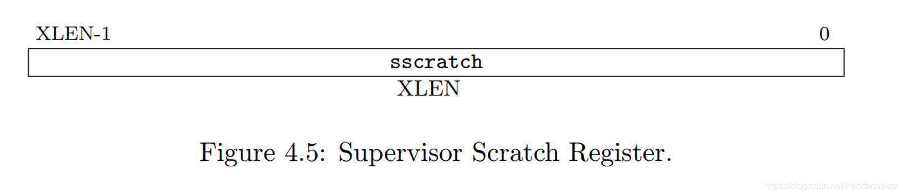
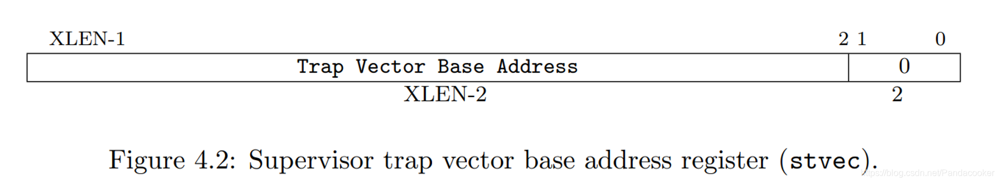
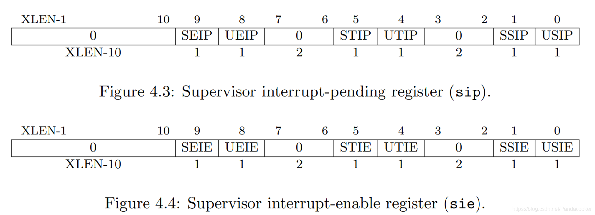
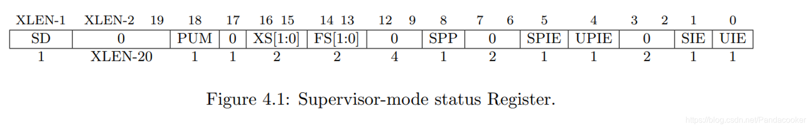

# 中断流程的追踪和理解

ucore的中断工作机制大致可以分为以下几个部分：

　　1. IDT中断描述符表的建立

　　2. 中断栈帧的生成

　　3. 接收到中断栈帧，通过对应的中断服务例程进行处理

　　4. 中断服务例程处理完毕，中断返回

## kern_init
在lab1的init.c中，相比lab0在kern_init()中多了四行代码，其中后面三个涉及到时钟与中断的内容：

```
    print_kerninfo();
    idt_init();
    clock_init();
    intr_enable();
```

## idt_init()
这是第一个开始真正执行中断的函数，其定义如下：
```
// kern/trap/trap.c
void idt_init(void) {
    extern void __alltraps(void);
    write_csr(sscratch, 0);
    write_csr(stvec, &__alltraps);
}
```
__alltraps是在trapentry.S中定义的一个内联汇编的函数，它把上下文包装成结构体并送到trap函数，并且调用了trap函数，进而调用了trap_dispatch()函数。

而write_csr看起来是一个函数，实际是一个宏，在riscv.c中定义，它用来写入特定的控制和状态寄存器。（这就是为什么在vscode中无法跳转到write_csr、sscratch无法被解析）




sscratch和stvec是两个控制和状态寄存器（CSR）：

- sscratch：用于保存trap发生时的一些信息

- stvec：指向一个中断向量表

综上，这里是将sscratch置零，并将__alltraps的地址写入stvec。前一步是将sscratch初始化，后一步是为了后面在中断产生时CPU能找到中断处理程序__alltraps。


## write_csr()
```
\\ libs/riscv.h
#define write_csr(reg, val) ({ \
  if (__builtin_constant_p(val) && (unsigned long)(val) < 32) \
    asm volatile ("csrw " #reg ", %0" :: "i"(val)); \
  else \
    asm volatile ("csrw " #reg ", %0" :: "r"(val)); })
```
- csrw即 “ Write to a Control and Status Register ” ，意思是向控制和状态寄存器中写入数据。


## __alltraps()
```
__alltraps:
    SAVE_ALL

    move  a0, sp
    jal trap
```
- `SAVE_ALL`是一个汇编宏，它保存了32个通用寄存器，以及4个和中断有关的CSR
- `move a0, sp`将栈指针保存在a0中，以备后续使用
- `jal trap`调用trap函数

（Challenge1）CSR远不止四个寄存器，显然这里只是保存了其中4个和中断有关的CSR，以便于留存中断信息。

## SAVE_ALL

（Challenge2）在SAVED_ALL中，有些指令需要注意：
```
csrw sscratch, sp
```
这里是将栈顶寄存器存储的中断发生时的栈顶地址存进sscratch寄存器中，这个操作是为了在trap发生时，能够知道一些中断的信息。

```
csrrw s0, sscratch, x0
```
- csrrw是 “ Control and Status Register Read and Write ” ，比csrw多了一个读操作。

RISCV不能直接从CSR写到内存, 需要csrr把CSR读取到通用寄存器，再从通用寄存器STORE到内存。

这条指令会把 sscratch 寄存器的值读入 s0，然后把 x0 的值写入 sscratch 寄存器。实际意义就是将sscratch寄存器的值存入s0来进一步把sscratch的值存入内存，然后将sscratch寄存器置零（恢复初始值）。

#### 以上两条汇编代码借助sscratch寄存器，成功保存了发生中断或异常时sp寄存器的值。


## 结构体trapframe
```
struct trapframe {
    struct pushregs gpr;  //32个通用寄存器
    uintptr_t status;     //sstatus 保存发生中断或异常时的sp
    uintptr_t epc;        //sepc 保存发生中断或异常时的pc
    uintptr_t badvaddr;
    uintptr_t cause;      //scause 保存发生中断或异常的原因
};
```
- （Challenge2）在SAVE_ALL中，这些值显然是被打包存到结构体trapframe的对象tf了，它们为中断/异常的处理提供辅助，但在返回的汇编宏RESTORE_ALL中，sbadaddr和scause没有被恢复，这些信息被处理后，寄存器的值不再需要，因此不用恢复。另外两个值则要辅助sp和pc恢复发生中断/异常的位置和指令，所以得保存。

- sbadaddr：对于具有变长指令的RISC-V系统上的指令读取访问错误，使用sbadaddr指向导致故障的指令部分，而sepc指向指令的开始。


## trap()
```
void trap(struct trapframe *tf) { trap_dispatch(tf); }
```
- （Challenge1）回顾上面`__alltraps()`内的汇编码`move a0, sp`和`jal trap`，`move a0, sp`操作的本质就是为trap函数传参：
trap函数的第一个参数是trapframe指针，而sp寄存器代表的地址开始从低到高分别保存着32个通用寄存器的值以及`sstatus`、`sepc`、`sbadaddr`、`scause`这四个CSR的值，这样的结构显然是和结构体trapframe匹配的，验证了我对`move a0, sp`用于trap函数传参的推断。

- （Challenge1）`SAVE_ALL`中寄存器保存在栈中的位置是什么确定的：
每个寄存器都被保存在栈中相应的偏移量处，通过将栈指针sp减去36 * REGBYTES，为所有寄存器分配足够的空间。而计算偏移量的方式是基于寄存器的索引（0到31），乘以REGBYTES，然后加上sp。这样可以确保每个寄存器在栈中的位置是连续的且按顺序保存的。


## trap_dispatch()
```
static inline void trap_dispatch(struct trapframe *tf) {
    if ((intptr_t)tf->cause < 0) {
        interrupt_handler(tf);
    } else {
        exception_handler(tf);
    }
}
```
这里会根据寄存器scause的值判断是中断还是异常，如果是中断，则调用interrupt_handler()函数；如果是异常，则调用exception_handler()函数。这两个跳转的函数都是在实验中需要完成的部分，它们都定义在trap.c中，内部是一个巨大的switch-case语句。


## clock_init()
```
void clock_init(void) {
    set_csr(sie, MIP_STIP);
    clock_set_next_event();
    ticks = 0;
    cprintf("++ setup timer interrupts\n");
}
```



- sie：“ S-mode interrupt enable ”, 根据bit位置保存相应的中断或异常是否开启。

通过clock_set_next_event()函数可以设置下一次中断的时间，此时ticks置零，则是为了后面trap_dispatch()函数中判断是否到达下一次中断的时间。


```
// driver/clock.c
void clock_set_next_event(void) { sbi_set_timer(get_cycles() + timebase); }
```
```
// libs/sbi.c
void sbi_set_timer(unsigned long long stime_value) {
    sbi_call(SBI_SET_TIMER, stime_value, 0, 0);
}

uint64_t sbi_call(uint64_t sbi_type, uint64_t arg0, uint64_t arg1, uint64_t arg2) {
    uint64_t ret_val;
    __asm__ volatile (
        "mv x17, %[sbi_type]\n"
        "mv x10, %[arg0]\n"
        "mv x11, %[arg1]\n"
        "mv x12, %[arg2]\n"
        "ecall\n"
        "mv %[ret_val], x10"
        : [ret_val] "=r" (ret_val)
        : [sbi_type] "r" (sbi_type), [arg0] "r" (arg0), [arg1] "r" (arg1), [arg2] "r" (arg2)
        : "memory"
    );
    return ret_val;
}
```

这段代码中的`sbi_set_timer`函数通过SBI调用间接触发了定时器中断的发生，这里用到的指令是`ecall`。

- “陷入(Trap)，指我们主动通过一条指令停下来，并跳转到处理函数。常见的形式有通过ecall进行系统调用(syscall)，或通过ebreak进入断点(breakpoint)。”        ——《实验手册·riscv64 中断介绍》

ecall(environment call)：当我们在 S 态执行这条指令时，会触发一个 ecall-from-s-mode-exception，从而进入 M 模式中的中断处理流程（如设置定时器等）；当我们在 U 态执行这条指令时，会触发一个 ecall-from-u-mode-exception，从而进入 S 模式中的中断处理流程（常用来进行系统调用）。


## intr_enable()
```
void intr_enable(void) { set_csr(sstatus, SSTATUS_SIE); }
```


- sstatus：“ S-mode status ”, 保存S模式的状态，包括中断使能位（SIE使能S态的全局中断。为0时S态的中断不发生）
- SSTATUS_SIE：0x00000002


# 其他注意事项

- 出现中断时，中断返回地址 mepc 的值被更新为下一条尚未执行的指令。
- 出现异常时，中断返回地址 mepc 的值被更新为当前发生异常的指令 PC。

如果异常由 ecall 或 ebreak 产生，由于 mepc 的值被更新为 ecall 或 ebreak 指令自己的PC。因此在异常返回时，如果直接使用 mepc 保存的 PC 值作为返回地址，则会再次跳回 ecall 或者 ebreak 指令，从而造成死循环（执行 ecall 或者 ebreak 指令导致重新进入异常）。

正确的做法是在异常处理程序中软件改变 mepc 指向下一条指令，由于现在 ecall/ebreak（或 c.ebreak）是 4（或 2）字节指令，因此改写设定 mepc=mepc+4（或+2）即可。

- RISC-V 架构规定，在进入异常时，硬件将自动更新机器模式异常值寄存器 mtval（Machine Trap Value Register ），以反映引起当前异常的存储器访问地址或者指令编码。