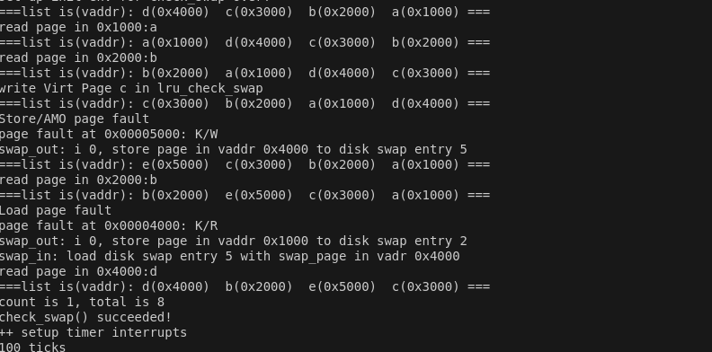

# challenge: lru页替换算法

## 一、设计

### 1.算法核心

选择替换页面时，选择的是“**最近最少使用**”的页面，即上一次访问最久远的页面。

### 2.数据结构

采用双向链表，创建head节点以方便后续操作。

最近被访问的页面被放置到链表的最前面。

每次替换时，选择链表最后端的节点替换。

### 3.示例

维护可替换页面的双向链表为lru_pra_list_head，头部节点为head,作辅助作用。

一开始仅有head节点。依次访问a,b,c,d.

那么链表为：

head<->d<->c<->b<->a<->head。

如果再次访问a:

head<->a<->d<->c<->b<->head。

如果访问未知e:

head<->a<->d<->c<->e<->head。

### 4.代码核心部分

1）增加打印链表函数（swap_lru.c)

```
void print_list()//打印虚拟地址
{
    list_entry_t *head = &lru_pra_list_head, *le = head;
    cprintf("===list is(vaddr):");
    while ((le = list_next(le)) != head)
    {
        struct Page* page = le2page(le, pra_page_link);
        cprintf(" 0x%x ", page->pra_vaddr);
    }
    cprintf("===\n");
}
```

2)增加最近访问某地址，重排改节点在链表中位置的函数

```
void recent_visit(uintptr_t addr)//把对应地址的page插到链表首部
{
    list_entry_t *head = &lru_pra_list_head, *le = head;
    while ((le = list_next(le)) != head)
    {
        struct Page* page = le2page(le, pra_page_link);
        if(page->pra_vaddr==addr)
        {
            list_entry_t *tmp=&page->pra_page_link;
            inc_viscount(page);
            //cprintf("change list: 0x%x---",addr);
            list_del(le);//从原来位置删除
            //print_list();
            list_add(head,tmp);//放在首部
        }
    }
    print_list();

}
```

3）其他部分

```
list_entry_t lru_pra_list_head;

static int
_lru_init_mm(struct mm_struct *mm)
{     
     list_init(&lru_pra_list_head);
     mm->sm_priv = &lru_pra_list_head;
     cprintf(" mm->sm_priv %x in lru_init_mm\n",mm->sm_priv);
     return 0;
}

static int
_lru_map_swappable(struct mm_struct *mm, uintptr_t addr, struct Page *page, int swap_in)
{
    list_entry_t *head=(list_entry_t*) mm->sm_priv;
    list_entry_t *entry=&(page->pra_page_link);
 
    assert(entry != NULL && head != NULL);
    //record the page access situlation

    //(1)把最近抵达的页面放在链表的头部
    //抵达顺序：1->2->3
    //head<->entry3<->entry2<->entry1<->head
    //cprintf("lru_map_swappable is called!The page is %x\n",page->pra_vaddr );
    list_add(head, entry);
    return 0;
    
}


static int
_lru_swap_out_victim(struct mm_struct *mm, struct Page ** ptr_page, int in_tick)
{
    list_entry_t *head=(list_entry_t*) mm->sm_priv;
    assert(head != NULL);
    assert(in_tick==0);
    list_entry_t* entry = list_prev(head);//选择链表尾部的节点，即最近没有访问的节点
    if (entry != head) {
        list_del(entry);
        *ptr_page = le2page(entry, pra_page_link);
    } else {
        *ptr_page = NULL;
    }
    //cprintf("lru_swap_out_victim is called!The page vaddr is  0x%x\n",(*ptr_page)->pra_vaddr);
    return 0;
}
```


## 二、分析

### 1.难点1：**代码的哪部分模拟了页面的访问**？

1）页面访问应该由用户程序或者内核来完成。在lab3中，尚未实现用户态执行的程序，只实现了换入换出的机制。

所以页面的访问，实际上来自于**check_swap**函数。在check_swap函数中，我们先在内存中分配一些页，**模拟一些页的访问**，然后通过do_pgfault来调用swap_map_swappable函数来查询这些页的访问情况。

2）这些模拟访问主要来自两个函数，一个是**check_content_set**,一个是**check_content_access**(这个函数实际上调用了sm->check_swap).

下面来看看check_content_set函数，实际上模拟的都是页面写操作：

```
static inline void
check_content_set(void)
{
     *(unsigned char *)0x1000 = 0x0a;//第一次写入页面，触发缺页异常
     assert(pgfault_num==1);
     *(unsigned char *)0x1010 = 0x0a;//把同一页面写入同一地址，不会触发缺页异常
     assert(pgfault_num==1);
     *(unsigned char *)0x2000 = 0x0b;
     assert(pgfault_num==2);
     *(unsigned char *)0x2010 = 0x0b;//把同一页面写入不同地址，不会触发缺页异常
     assert(pgfault_num==2);
     *(unsigned char *)0x3000 = 0x0c;
     assert(pgfault_num==3);
     *(unsigned char *)0x3010 = 0x0c;
     assert(pgfault_num==3);
     *(unsigned char *)0x4000 = 0x0d;
     assert(pgfault_num==4);
     *(unsigned char *)0x4010 = 0x0d;
     assert(pgfault_num==4);
}
```

也能看到四次缺页异常的打印

```
Store/AMO page fault
page fault at 0x00001000: K/W
Store/AMO page fault
page fault at 0x00002000: K/W
Store/AMO page fault
page fault at 0x00003000: K/W
Store/AMO page fault
page fault at 0x00004000: K/W
```


### 2.难点2：如何记录页面的访问？

仅仅是页面的换入、换出的话，可以通过_lru_map_swappable和_lru_swap_out_victim观察到，从而改变页面在链表中的位置。

然而，对相同地址的访问，不引发缺页异常的话，已有的API很难观察到。

于是增加recent_visit函数，每次不引发缺页异常的读/写操作都调用它，以记录页面的访问，改变页面在链表中的位置。

调用示例：

```
if(pgfault_num==t){recent_visit(0x5000);}
    else{print_list();}
```


## 三、测试

### 1.测试代码

包含读、写操作；有引发缺页异常的，也有正常的。从输出结果和page_fault数量能判断正确性。

```
static int
_lru_check_swap(void) {
    int t=4;
    cprintf("read page in 0x1000:%x\n",*(unsigned char *)0x1000);
    if(pgfault_num==t){recent_visit(0x1000);}
    //print_list();
    cprintf("read page in 0x2000:%x\n",*(unsigned char *)0x2000);
    if(pgfault_num==t){recent_visit(0x2000);}
    cprintf("write Virt Page c in lru_check_swap\n");
    *(unsigned char *)0x3000 = 0x0c;
    if(pgfault_num==t){recent_visit(0x3000);}
    else{print_list();}
    // 在这个赋值之后，0x4000页面被换出去
    *(unsigned char *)0x5000 = 0x0e;
    assert(pgfault_num==5);
    t++;
    if(pgfault_num==t){recent_visit(0x5000);}
    else{print_list();}
    cprintf("read page in 0x2000:%x\n",*(unsigned char *)0x2000);
    if(pgfault_num==t){recent_visit(0x2000);}
    else{print_list();}
    //0x1000被替换出去
    cprintf("read page in 0x4000:%x\n",*(unsigned char *)0x4000);
    assert(pgfault_num==6);
    t++;
    print_list();
    return 0;
}
```


### 2.测试结果

