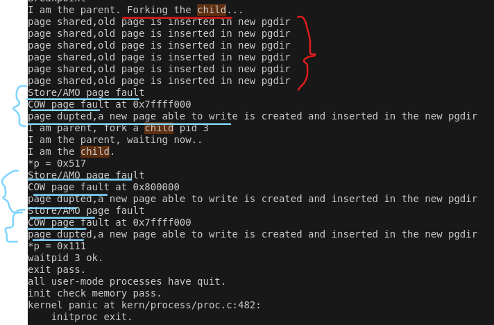

# Lab5 Challenge

## 一、写时复制（COW）

### 1.COW机制

1）内存共享：在子进程创建时，不会复制父进程的页，而是让子进程共享父进程的页。同时，所有共享的页都设置为可读。

2）缺页异常的触发：当某个进程试图写入共享的页时，会触发缺页异常，操作系统捕获后会检查页表项的写权限，为触发COW异常的进程分配一个新的页。原始页的内容会复制到这个新页，并且该进程的页表项会指向新页，只有该进程才能修改它。故为写时复制。

### 2.实现思路

1）在`vmm.c`中的`dup_mmap`，将`copy_range`修改成`cow_copy_range`.

因为**需要在拷贝过程中，将所有共享页面设置为可读**。所以需要修改拷贝页面的函数。

```
int
dup_mmap(struct mm_struct *to, struct mm_struct *from) {
    assert(to != NULL && from != NULL);
    list_entry_t *list = &(from->mmap_list), *le = list;
    while ((le = list_prev(le)) != list) {
        struct vma_struct *vma, *nvma;
        vma = le2vma(le, list_link);
        nvma = vma_create(vma->vm_start, vma->vm_end, vma->vm_flags);
        if (nvma == NULL) {
            return -E_NO_MEM;
        }

        insert_vma_struct(to, nvma);

        bool share = 0;
        //只需要把copy_rage修改成cow_copy_range,并单独处理cow_pgfault即可
        if (copy_range(to->pgdir, from->pgdir, vma->vm_start, vma->vm_end, share) != 0) {
            return -E_NO_MEM;
        }
    }
    return 0;
}
```

2）在`pmm.c`中单独增加`cow_copy_range`函数。在`pmm.h`中增加函数声明。

相较copy_range函数，改动点有三处：

A.去除待拷贝旧页面的写权限

B.去除已拷贝页面的读权限

C.页表项中插入的是旧页，而不是新分配的一页（所以也无需分配操作）

```
//pmm.h
int cow_copy_range(pde_t *to, pde_t *from, uintptr_t start, uintptr_t end);
//pmm.c
int cow_copy_range(pde_t *to, pde_t *from, uintptr_t start, uintptr_t end) {
    assert(start % PGSIZE == 0 && end % PGSIZE == 0);
    assert(USER_ACCESS(start, end));
    do {
        pte_t *ptep = get_pte(from, start, 0);
        if (ptep == NULL) {
            start = ROUNDDOWN(start + PTSIZE, PTSIZE);
            continue;
        }
        if (*ptep & PTE_V) {
            // 读取页表项，并清除写入权限
            *ptep &= ~PTE_W;//改动1：清除旧页面写权限
            uint32_t perm = (*ptep & PTE_USER & ~PTE_W);//改动2：清除新页面写权限
            struct Page *page = pte2page(*ptep);
            assert(page != NULL);
            int ret = 0;
            // 将页插入到新的页表中
            ret = page_insert(to, page, start, perm);//改动三：页表项中插入的是旧页，而不是新分配一页
            assert(ret == 0);
        }
        start += PGSIZE;
    } while (start != 0 && start < end);
    return 0;
}

```

3）增加在`vmm.c`中，`do_pgfault`中增加对`COW缺页异常`的判断与处理,即单独处理写入共享页面（不可写页面）时触发的缺页异常。

```
//do_pgfault
if ((ptep = get_pte(mm->pgdir, addr, 0)) != NULL) {
        if((*ptep & PTE_V) & ~(*ptep & PTE_W)) {
            cprintf("COW page fault at 0x%x\n", addr);
            int ret = 0;
            pte_t *ptep = NULL;
            // 获取引发错误的地址对应的页表项
            ptep = get_pte(mm->pgdir, addr, 0);
            uint32_t perm = (*ptep & PTE_USER) | PTE_W;
            //下面的内容类似copy_range
            struct Page *page = pte2page(*ptep);
            struct Page *npage = alloc_page();
            assert(page != NULL);
            assert(npage != NULL);
            uintptr_t* src = page2kva(page);
            uintptr_t* dst = page2kva(npage);
            // 复制原始页的内容到新页
            memcpy(dst, src, PGSIZE);
            uintptr_t start = ROUNDDOWN(addr, PGSIZE);
            *ptep = 0;
            // 插入新页
            ret = page_insert(mm->pgdir, npage, start, perm);
            ptep = get_pte(mm->pgdir, addr, 0);
            return ret;
        }
    }
```

### 3.测试验证

1)在`cow_copy_range`与`do_pgfault`增加输出，观察页面是共享还是复制。

```
//cow_copy_range
cprintf("page shared,old page is inserted in new pgdir\n");
//do_pgfault
cprintf("apage dupted,a new page able to write is created and inserted in the new pgdir\n");
```

2)在`user/exit.c`中增加下面代码,测试子进程写入共享页面时，触发pgfault,复制一个有写权限的新页写入：

```
        uintptr_t* p = 0x800592;
        cprintf("*p = 0x%x\n", *p);
        *p = 0x111;
        cprintf("*p = 0x%x\n", *p);
```


结果如下：

可以看到，创建子进程时，仅共享页面；而需要写入内容时，触发Store/AMO Page fault的同时也会触发COW pgfault,从而复制一个新页，向新页中写入。



## 二、用户程序加载时机，与常用加载区别。

### 1、用户程序是何时被预先加载到内存中的？

 用户程序的加载发生在 `qemu` 模拟器启动之后，ucore内核完成初始化并进入用户态之后。

**编译和链接:** `make` 命令首先编译内核代码（`kern/` 目录下的代码）和用户程序代码（`user/` 目录下的代码）。  `user.ld` 链接脚本在链接用户程序时被使用，它定义了用户程序在内存中的段布局（代码段、数据段、堆栈等）。  但是，`user.ld` 仅仅定义了用户程序内部的内存布局，而不是用户程序在系统内存中的位置。 

 **内核启动:**  `qemu` 模拟器启动后，ucore内核开始运行。内核初始化各种硬件设备、内存管理、进程调度等模块。 在内核初始化完成后，用户程序被加载。

### 2、与我们常用操作系统的加载有何区别,原因是什么？

ucore 的用户程序加载机制与完整操作系统（如 Linux）的主要区别在于：

**静态链接 vs 动态链接:** ucore采用`静态链接`，用户程序的所有依赖库都直接链接进可执行文件中。  完整操作系统通常`支持动态链接`，允许程序在运行时加载共享库，从而节省内存并方便程序更新。 

 **内存管理:** ucore的内存管理相对简单，直接将用户程序加载到预先分配好的内存空间。  完整操作系统通常有更精细的内存管理机制，可以更有效地利用内存资源并保护系统安全。


